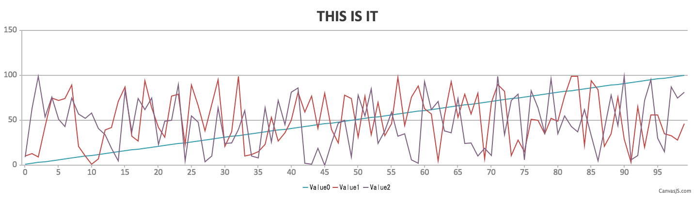
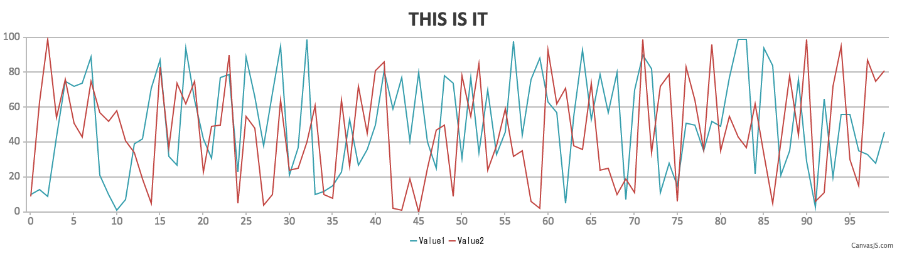

WTF is these?
=============

easy csv-to-http graph utilities


# csv2chart
This command parses single & multicolumn csv file and draw chart in html
Can accept multi single column csv file or multicolumn file by '-m'
With multicolumn file, '-c' with comma-separated column name can be used

```
Usage: csv2chart [-fFhsU] [-t title] [-o outputdir] [-n outputfile] [-c column0,column1...] [-m mcsvfile] csvfile csvfile1 csvfile2 ...
   -f              force overwrite outputdir and outputfile
   -F              ignore first column
   -h              show this help
   -U              translate first column from Unix epoch to local time string
   -i              translate first column from string to integer
   -t <title>      set TITLE to <title>
   -o <dir>        use specified directory for output (creates if not exists)
   -n <name>       use specified name to output html (default: output.html)
   -m <csvfile>    specify source multi-column csv file
   -c <columns>    comma-separated name for each series in multi-column csv (used with -m)
   <args>          multiple csv files to combine (exclusive with -m)

```

## Typical Usage:
Plot simple csv file (contains timestamp and data)

```
% csv2chart -U -t "THIS IS IT" -o myoutput -n myoutput0.html -m myoutput0.csv -c Time,Value
```

Plot multi-column csv file

```
% csv2chart -U -t "THIS IS IT" -o myoutput -n myoutput0.html -m myoutput0.csv -c Time,Height,Width
```

Combine and plot multiple csv file

```
% csv2chart -t "THIS IS IT" -o myoutput -n myoutput0.html data0.csv data1.csv data2.csv
```


## example

There are some testdata in ./testdata

- ./testdata/3cols_data.csv: multi (3) column csv file
- ./testdata/3cols_timestamp_data.csv: multi (3) column csv file with timestamp


For example, if you execute cvs2chart with 3cols_data.csv

```
./csv2chart -t "THIS IS IT" -o myoutput -n myoutput0.html -m testdata/3cols_data.csv -c Value0,Value1,Value2
```

you will get html like this




Apparently blue line (Value0) is incremental and seems like just an index.
So let's ignore the first column with "-F" option.
(BTW, you need to specify "-f" to overwrite previous output)

```
./csv2chart -f -F -t "THIS IS IT" -o myoutput -n myoutput0.html -m testdata/3cols_data.csv -c Value0,Value1,Value2
```

then, you will get html like this




Another example on 3cols_timestamp_data.csv.
This file has unix epoch timestamps on its first column, so if you use
"-U" option like this

```
./csv2chart -f -U -t "THIS IS IT" -o myoutput -n myoutput0.html -m testdata/3cols_timestamp_data.csv -f -c Time,Value0,Value1
```

then, csv2chart automatically converts it with exact string format

![3cols_timestamp_data][testdata/graph_3cols_timestamp_data.png)

# heatmappoint

Point coordinations collector for heatmap generation.
This is utility for latter "heatmapgen".

```
# ./heatmappoint -f -o ~/heatmap_output/ -n hetmappoint.html -i ~/map.png
```


# heatmapgen (TBD)

